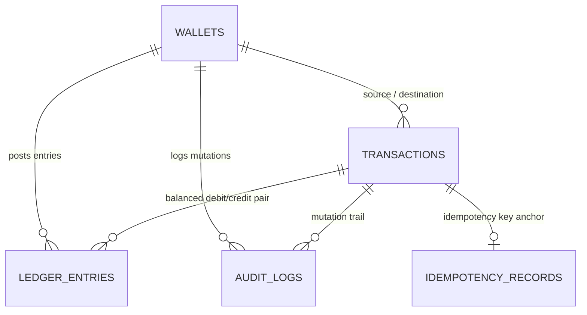

# NovaWallet Ledger Service — FirstBank NovaPay

A high-integrity, concurrency-safe wallet ledger backend service built in **.NET 8 (C#)** for FirstBank's **NovaPay** platform.

The system implements strict double-entry ledger accounting, idempotent transfer processing, daily outbound limit enforcement (midnight WAT), append-only immutable audit logging, and concurrency controls designed to guarantee balances never go negative or allow double-spending under concurrent load.

---

## 1. System Architecture

The solution follows Clean Architecture / DDD separation of concerns across three core projects:

```
NovaWallet.sln
├── src/
│   ├── NovaWallet.Domain/          # Pure domain models, value types, enums, interfaces
│   │   ├── Entities/               # Wallet, Transaction, LedgerEntry, AuditLog, IdempotencyRecord
│   │   └── Enums/                  # WalletStatus, TransactionType, EntryType, TransactionChannel
│   ├── NovaWallet.Infrastructure/  # Persistence, EF Core, database configurations, migrations
│   │   ├── Data/                   # AppDbContext, entity fluent configurations
│   │   └── Migrations/             # Version-controlled EF Core schema migrations
│   └── NovaWallet.Api/             # Controllers, DTOs, Middlewares, Program.cs entrypoint
```

### Core Financial Entities & Schema



1. **`Wallet`**: Stores account state, currency (`NGN`), balance in kobo, status (`Active`, `Frozen`, `Closed`), and daily limit counters.
2. **`Transaction`**: The high-level intent record representing an inbound credit, outbound transfer, or fee. Holds unique business reference and terminal timestamps (`CompletedAt`, `FailedAt`, `ReversedAt`).
3. **`LedgerEntry`**: Append-only immutable journal entries. Every transfer creates exactly two balanced entries: one `Debit` and one `Credit`.
4. **`AuditLog`**: Append-only record of every balance mutation capturing `BalanceBeforeKobo` and `BalanceAfterKobo` for non-repudiation and regulatory auditing.
5. **`IdempotencyRecord`**: Caches requests by `Idempotency-Key` header with SHA-256 payload hashing to prevent replay attacks and reject modified payloads.

---

## 2. Key Decisions & Trade-Offs

### 2.1 Integer Kobo Representation (No Floating Point)

- **Decision**: All monetary quantities are stored and computed as 64-bit signed integers (`long`) in kobo ($\text{₦}1.00 = 100\text{ kobo}$).
- **Rationale**: Floating-point numbers (`float`, `double`) suffer from binary representation drift in IEEE 754 arithmetic (e.g. `0.1 + 0.2 != 0.3`). Long integers guarantee exact arithmetic precision for all balance mutations.

### 2.2 Concurrency Control: Pessimistic Row Locking with Ordered Locks

- **Decision**: Balance mutations lock affected wallet rows using PostgreSQL pessimistic locking (`SELECT ... FOR UPDATE`).
- **Why not Optimistic Locking (`Version`)?** Optimistic concurrency works well under low contention, but under concurrent bursts (e.g. 20 concurrent transfers hitting the same wallet), optimistic concurrency throws `DbUpdateConcurrencyException` on 19 of them, requiring complex application-level retry loops. Pessimistic row locking allows the database to queue requests cleanly and process each transfer sequentially without spurious failures.
- **Deadlock Prevention**: Transfers lock the source and destination wallets in a **deterministic order** (e.g. ordered by `Wallet.Id` GUID). This eliminates circular wait conditions (Alice $\rightarrow$ Bob while Bob $\rightarrow$ Alice).

### 2.3 Database Migrations in Production vs. Containerized Demo

- **Decision**: The API executes `db.Database.Migrate()` on startup **only** when `ASPNETCORE_ENVIRONMENT=Development` or `ApplyMigrationsOnStartup=true`.
- **Production Reality**: In high-scale multi-replica production (e.g., Kubernetes/ECS), running migrations on app startup is an anti-pattern (causes replica race conditions, requires elevated DDL permissions for runtime app roles, and risks crash loops). In production at FirstBank, migrations are compiled into standalone migration bundles (`dotnet ef migrations bundle`) or idempotent SQL scripts executed in the CI/CD pipeline as a pre-deployment step with restricted administrative credentials.
- For the review demo, `ApplyMigrationsOnStartup=true` is enabled in `docker-compose.yml` so the entire datastore and service initialize seamlessly with a single command.

### 2.4 Timezone Handling: Midnight WAT (West Africa Time)

- **Decision**: Daily outbound limits reset at midnight West Africa Time (`WAT` / UTC+1).
- **Rationale**: Nigerian banking regulations operate on local business days. All limit checks evaluate dates relative to `Africa/Lagos` timezone rather than naive UTC.

---

## 3. Getting Started & Running

### Prerequisites

- Docker & Docker Compose (or .NET 8 SDK + PostgreSQL 16)

### Run with Docker Compose (Single Command)

Per the non-negotiable assessment requirements:

```bash
docker compose up --build
```

This will:

1. Start PostgreSQL 16 on port `5432` with healthcheck.
2. Build the multi-stage .NET 8 API image.
3. Automatically apply EF Core migrations on startup.
4. Expose the API and OpenAPI/Swagger UI on port `8080`.

- **Swagger / OpenAPI Documentation:** [http://localhost:8080/swagger](http://localhost:8080/swagger)
- **Health Endpoint:** [http://localhost:8080/health](http://localhost:8080/health)

---

## 4. Running Locally without Docker

1. Ensure PostgreSQL is running locally and update `ConnectionStrings:DefaultConnection` in `src/NovaWallet.Api/appsettings.Development.json`.
2. Apply migrations:
   ```bash
   dotnet ef database update --project src/NovaWallet.Infrastructure --startup-project src/NovaWallet.Api
   ```
3. Run the API:
   ```bash
   dotnet run --project src/NovaWallet.Api
   ```
4. Access Swagger UI at `https://localhost:7001/swagger` (or `http://localhost:5000/swagger`).

---

## 5. Running Automated & Concurrency Tests

```bash
dotnet test
```

_(Tests include unit validations, idempotency replays, and multi-threaded parallel transfers testing balance invariants under concurrent load)._
